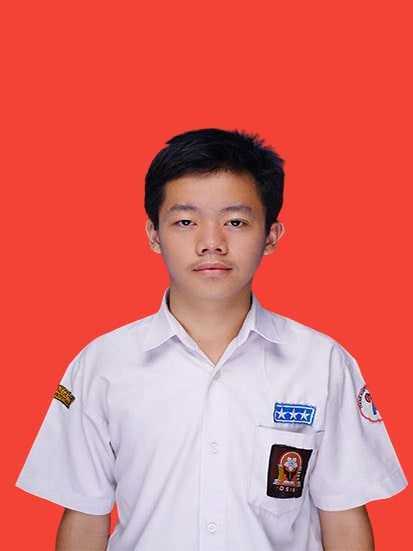
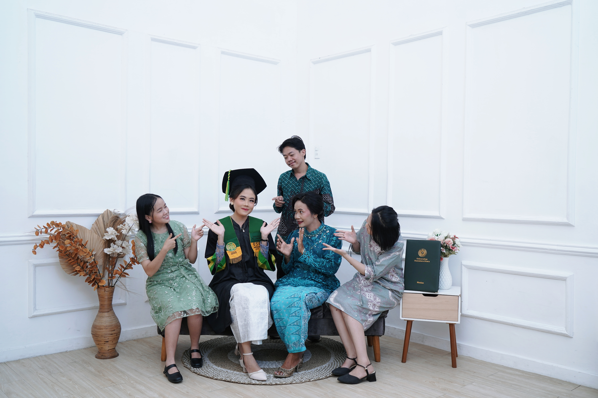

<html lang="id">
<head>
  <meta charset="UTF-8">
  <meta name="viewport" content="width=device-width, initial-scale=1.0">
  <title>Portofolio - Tony Sinaga</title>
  
</head>
<body>
  <header>
    <h1>Tony Wijaya Sinaga</h1>
    
Web Developer & Designer

  </header>

  

    <!-- Sidebar -->
    <nav>
      <h2>Dashboard</h2>
      <ul>
        <li><a href="#profil">Profil</a></li>
        <li><a href="#keluarga">Keluarga</a></li>
        <li><a href="#pendidikan">Pendidikan</a></li>
        <li><a href="#motto">Motto</a></li>
      </ul>
    </nav>

   <!-- Main Content -->
    <main>
      <section id="profil">
        <h2>Profil</h2>
        
        
Halo! Saya <b>Tony Sinaga</b>, seorang Web Developer & Designer dengan pengalaman 6 tahun. 
        Saya berfokus pada pembuatan website modern, responsif, dan mudah digunakan.

      </section>

      <section id="keluarga">
        <h2>Keluarga</h2>
        
Saya berasal dari keluarga yang sederhana dan penuh kasih. 
        Keluarga selalu menjadi motivasi utama saya untuk terus berkembang dan berkarya.

        <!-- Foto keluarga -->
        

        
  

      </section>

      <section id="pendidikan">
        <h2>Pendidikan</h2>
        <ul>
          <li>SD Swasta Josua MEDAN</li>
          <li>SMP Negeri 35 MEDAN</li>
          <li>SMK Negeri 1 Percut Sei Tuan</li>
          <a href="https://smkn1-pst.sch.id" target="_blank">
          <li>Ahli Madya Komputer - Politeknik Negeri Medan</li>
        </ul>
      </section>

       <section id="karya">
  <h2>Karya Saya</h2>
  
Beberapa karya dan proyek yang sudah saya kerjakan:

  

    <!-- Karya 1 -->
    

      
      <h3>Website Portfolio</h3>
      
Website pribadi dengan desain modern menggunakan HTML, CSS, dan JavaScript.

      <a href="https://github.com/tonystank46/portfolio" target="_blank">Lihat</a>
    

    <!-- Karya 2 -->
    

      
      <h3>Aplikasi IoT</h3>
      
Sistem monitoring suhu berbasis Arduino & Blynk.

      <a href="#">Lihat</a>
    

    <!-- Karya 3 -->
    

      
      <h3>Desain UI</h3>
      
Mockup aplikasi mobile dengan Figma untuk manajemen tugas harian.

      <a href="#">Lihat</a>
    

  

</section>

      <section id="motto">
        <h2>Motto</h2>
        <blockquote>
          "Tetap rendah hati, terus belajar, dan jangan pernah takut gagal."
        </blockquote>
      </section>
    </main>
  

  <footer>
    
&copy; 2025 Tony Sinaga. All Rights Reserved.

  </footer>
</body>
</html>
